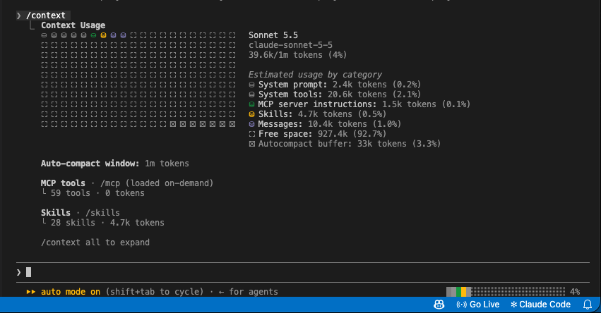

# context-bar

A Claude Code mod that draws an always-on stacked bar of your context window at the right of the
prompt footer, on the same row as `Auto mode on (shift+tab to cycle)`. One colour per `/context`
category, plus the percentage:

```
▇▇▇▅▅▂░░░░ 42%
```



## Install

Requires Claude Code 2.1.275 or later, in a terminal session. The footer is drawn on the terminal and
desktop app only (not the VS Code extension or mobile).

### From a git repository

```
/plugin install context-bar --marketplace Vihat-Software/claude-mod-context-bar
```

Answer `y` to add the marketplace, then pick a scope. Choose **user** to have the bar in every session
you start, or **project** to share it with one repo's team. The mod is active at once, with no reload.

`Vihat-Software/claude-mod-context-bar` can also be a full git URL.

### From a local clone

```
git clone https://github.com/Vihat-Software/claude-mod-context-bar.git ~/claude-mod-context-bar
claude plugin marketplace add ~/claude-mod-context-bar
claude plugin install context-bar@context-bar --scope user
```

After you edit the folder, run `/reload-plugins` in a session to pick the change up.

### Try it once without installing

```
claude --plugin-dir /path/to/claude-mod-context-bar
```

## Use

| What                | How                                                                 |
| ------------------- | ------------------------------------------------------------------- |
| See the bar         | Nothing to do. It shows once the session has context data.          |
| Hide / show the bar | Type `/context-bar` at the prompt. Run it again to bring it back.   |
| Full breakdown      | Type `/context` (the built-in command). The bar uses the same data. |

How to read the bar:

- Each coloured block is one `/context` category (system prompt, tools, messages, ...), sized by its
  share of the context window. Colours follow your terminal theme.
- `░` is free space, the dim block is the compaction buffer.
- The number at the end is the percentage of the window in use.
- It refreshes after each turn.

## Narrow terminals

The bar never wraps; it adapts to the width:

| Terminal width      | What is drawn                     |
| ------------------- | --------------------------------- |
| 110 columns or more | 24-cell bar                       |
| 70 to 109 columns   | 12-cell bar                       |
| under 70 columns    | nothing (the normal footer shows) |

It follows the window when you resize.

## Uninstall

```
/plugin uninstall context-bar
```

If you added a marketplace for it: `claude plugin marketplace remove context-bar`.

## Develop

```
claude plugin validate .      # manifest, marketplace file and hooks module
claude plugin test .          # unit tests (hooks/allocate.test.ts)
claude --plugin-dir .         # run it from this folder
```

Layout: `.claude-plugin/` holds the manifest and the marketplace file, `hooks/register.tsx` is the mod
itself, and `types/index.d.ts` is the contract for the state it keeps (the hidden flag and the last
reading).

## Troubleshooting

- **No bar:** the terminal may be under 70 columns, or the session has no context reading yet (send a
  prompt). Check that `/context-bar` has not hidden it.
- **Nothing changes after an edit:** run `/reload-plugins`.
- **Still nothing:** start `claude --debug` and look for lines starting with `context-bar:` or
  `ui.render (SessionMode)`.

## About

Made by [Vihat Software](https://vihatsoftware.com). Source and issues:
https://github.com/Vihat-Software/claude-mod-context-bar
